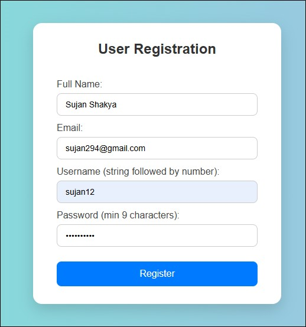
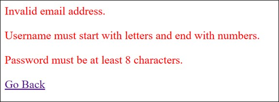

# 🔐 User Registration Form with Validation


A robust and secure PHP-based user registration system featuring comprehensive server-side validation, MySQL database integration, and a modern, responsive user interface.

---

## ✨ Features

- 📝 **Clean Registration Form** with intuitive user interface
- ✅ **Server-side Validation** for enhanced security
- 🗄️ **MySQL Database Integration** with proper table structure
- 📱 **Fully Responsive Design** that works on all devices
- 🎨 **Modern UI/UX** with smooth animations and transitions
- 🔒 **Secure Data Handling** with POST method
- 💬 **Real-time Feedback** with error and success messages
- 🚀 **Easy Setup** with automated table creation

---

## 🗂️ Project Structure

```
user-registration/
│
├── 📄 index.php              # Main registration form
├── 📄 submit.php             # Handles form submission, validation, and database insertion
├── 📄 createTable&db.php     # DB connection + creates the `users` table
├── 🎨 styles.css             # Styling and animations
├── 📁 screenshots/           # Project screenshots
└── 📄 README.md             # Documentation
```

> Note: Using `&` in file names can cause issues on some systems. If you encounter problems, consider renaming to `create_table_and_db.php` and update references.
---

## 🛠️ Tech Stack

| Technology | Purpose |
|------------|---------|
| **PHP 7.4+** | Backend logic & validation |
| **MySQL 5.7+** | Data persistence |
| **HTML5** | Structure & semantics |
| **CSS3** | Styling & animations |
| **JavaScript** | Client-side interactions |

---

## 📋 Prerequisites

Before you begin, ensure you have the following installed:

- 🐘 **PHP** (version 7.4 or higher)
- 🗄️ **MySQL** (version 5.7 or higher)
- 🌐 **Web Server** (Apache, Nginx, or XAMPP/WAMP/MAMP)
- 🖥️ **Web Browser** (Chrome, Firefox, Safari, or Edge)

---

## 🚀 Installation Guide

### 1️⃣ Clone the Repository
```bash
git clone https://github.com/Suresh-Shrestha1/user-registration.git
cd user-registration
```

### 2️⃣ Database Setup
```sql
-- Create the database
CREATE DATABASE IF NOT EXISTS user_db;
USE user_db;
```

### 3️⃣ Configure Database Connection
Update the database credentials in `submit.php` and `createTable&db.php`:
```php
$servername = "localhost";
$username = "your_username";
$password = "your_password";
$dbname = "user_db";
```

### 4️⃣ Create the Users Table
Run the setup script:
```bash
php createTable&db.php
```

### 5️⃣ Start Your Web Server
```bash
# If using PHP's built-in server
php -S localhost:8000

# Or place files in your web server's directory
# Example: /var/www/html/ or htdocs/
```

### 6️⃣ Access the Application
Open your browser and navigate to:
```
http://localhost:8000/index.php
```

---

## 📐 Database Schema

```sql
CREATE TABLE users (
    id INT(11) AUTO_INCREMENT PRIMARY KEY,
    fullname VARCHAR(40) NOT NULL,
    email VARCHAR(100) NOT NULL UNIQUE,
    username VARCHAR(50) NOT NULL UNIQUE,
    password VARCHAR(255) NOT NULL,
    created_at TIMESTAMP DEFAULT CURRENT_TIMESTAMP,
    INDEX idx_email (email),
    INDEX idx_username (username)
) ENGINE=InnoDB DEFAULT CHARSET=utf8mb4;
```

---

## ✔️ Validation Rules

| Field | Validation Rules | Example |
|-------|-----------------|---------|
| 📛 **Full Name** | • Required<br>• Max 40 characters<br>• Letters and spaces only | John Doe |
| 📧 **Email** | • Required<br>• Valid email format<br>• Unique in database | user@example.com |
| 👤 **Username** | • Required<br>• Letters followed by numbers<br>• 3-20 characters<br>• Unique | user123 |
| 🔑 **Password** | • Required<br>• Minimum 8 characters<br>• Mix of letters, numbers, symbols | Pass@123 |

Example HTML constraints (you can add these to `index.php` inputs):
```html
<input name="full_name" maxlength="40" required>
<input name="email" type="email" required>
<input name="username"
       required
       pattern="^[A-Za-z]+[A-Za-z0-9]*[0-9]+$"
       title="Start with letters and end with at least one number (e.g., user123)">
<input name="password" type="password" minlength="8" required>
```

Server-side (PHP) username check:
```php
if (!preg_match('/^[A-Za-z]+[A-Za-z0-9]*\d+$/', $username)) {
    $errors[] = 'Username must start with letters and end with numbers (e.g., user123).';
}
```

---

## 🔒 Security Considerations

### ⚠️ Current Implementation
- ❌ Passwords stored in plain text
- ❌ No CSRF protection
- ❌ No rate limiting
- ❌ Basic XSS protection only

### ✅ Recommended Improvements
```php
// Password Hashing
$hashedPassword = password_hash($password, PASSWORD_BCRYPT);

// Prepared Statements
$stmt = $conn->prepare("INSERT INTO users (fullname, email, username, password) VALUES (?, ?, ?, ?)");
$stmt->bind_param("ssss", $fullname, $email, $username, $hashedPassword);

// CSRF Token
session_start();
$_SESSION['csrf_token'] = bin2hex(random_bytes(32));
```

---

## 🎯 Future Enhancements

- [ ] 🔐 Implement password hashing with `password_hash()`
- [ ] 📧 Add email verification system
- [ ] 🔄 Implement password reset functionality
- [ ] 👥 Add user profile management
- [ ] 🛡️ Integrate CAPTCHA for bot protection
- [ ] 📱 Add two-factor authentication (2FA)
- [ ] 🌐 Implement OAuth login (Google, Facebook)
- [ ] 📊 Add admin dashboard for user management
- [ ] 🔍 Implement advanced search and filtering
- [ ] 📈 Add user activity logging

---

## 🧪 Testing

### Manual Testing Steps
1. **Valid Registration**: Test with all valid inputs
2. **Invalid Email**: Test with malformed email addresses
3. **Duplicate Users**: Try registering with existing email/username
4. **Empty Fields**: Submit form with empty fields
5. **Special Characters**: Test username with special characters
6. **Password Length**: Test with passwords shorter than 8 characters

### Sample Test Data
```
Full Name: John Doe
Email: john.doe@example.com
Username: johndoe123
Password: SecurePass@123
```

---

## 📸  Screenshots (optional)
- Figure 1: User Registration Form with fields for Full Name, Email, Username, and Password.

- Figure 2: Confirmation message displayed on successful user registration.

- Figure 3: Validation checks when submitting the form with missing or invalid data.

- Figure 4: Error messages shown when form validation fails.


---

## 🧭 Example Flow Messages

- Success: “Account created successfully 🎉”
- Errors:
  - “Full Name is required and must be less than 40 chars.”
  - “Invalid email address.”
  - “Username must start with letters and end with numbers.”
  - “Password must be at least 8 characters.”
  - “Email/Username already exists.”

---

## 🛠️ Troubleshooting

- Can’t connect to DB:
  - Check host/user/password in `createTable&db.php`
  - Ensure MySQL is running and `user_db` exists
- Duplicate email/username:
  - User a different value, or clear existing test rows
- 500 error:
  - Enable error reporting in PHP or check server logs

---

## 🧩 Extending The App

- Add fields: phone, avatar (file upload), role
- Add login + session management
- Add email verification
- Add rate limiting or CAPTCHA for bots
- Add client-side JS validation for enhanced UX

---

## 🤝 Contributing

Contributions are welcome! Please follow these steps:

1. Fork the repository
2. Create your feature branch (`git checkout -b feature/AmazingFeature`)
3. Commit your changes (`git commit -m 'Add some AmazingFeature'`)
4. Push to the branch (`git push origin feature/AmazingFeature`)
5. Open a Pull Request

---

## 📚 Resources

- 📖 [PHP Documentation](https://www.php.net/docs.php)
- 🗄️ [MySQL Documentation](https://dev.mysql.com/doc/)
- 🔒 [OWASP Security Guidelines](https://owasp.org/www-project-top-ten/)
- 🎨 [CSS Tricks](https://css-tricks.com/)

---

## 🐛 Known Issues

- Form doesn't retain data on validation errors
- No client-side validation implemented
- Password strength indicator missing
- No session management after registration

---
